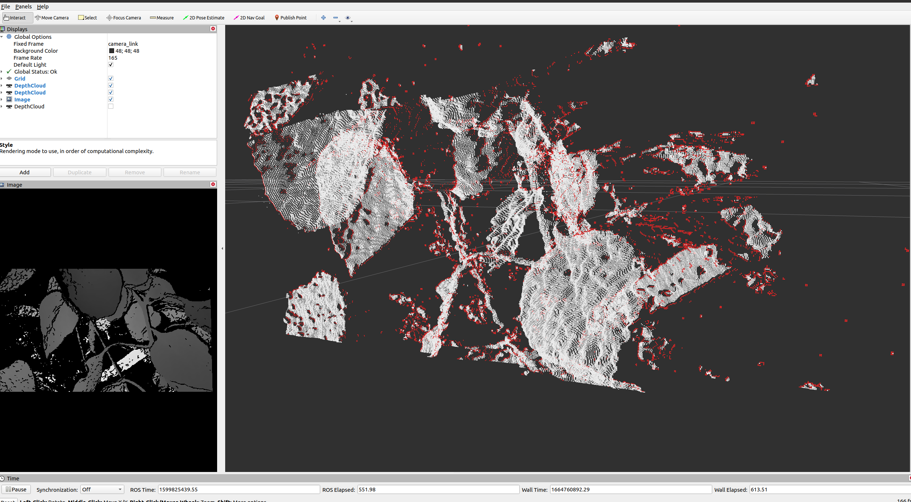

# depth_image_veiling_effect_filter

A similar approach to [laser_filters::ScanShadowsFilter](https://wiki.ros.org/laser_filters#ScanShadowsFilter) for depth images. Supports [dynamic_reconfigure](https://wiki.ros.org/dynamic_reconfigure) to modify parameters at runtime.

TODO:

- connected component filter? remove small components?
- convert to RangeImage and use RangeImageBorderExtractor.
- try implementing grid version of statistical outlier filter.
